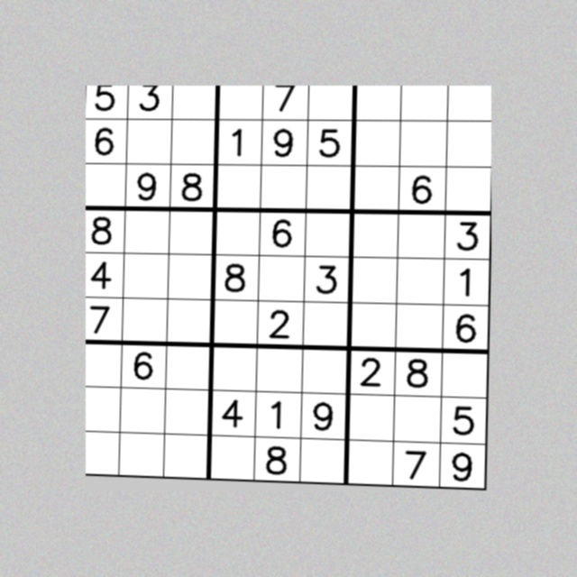
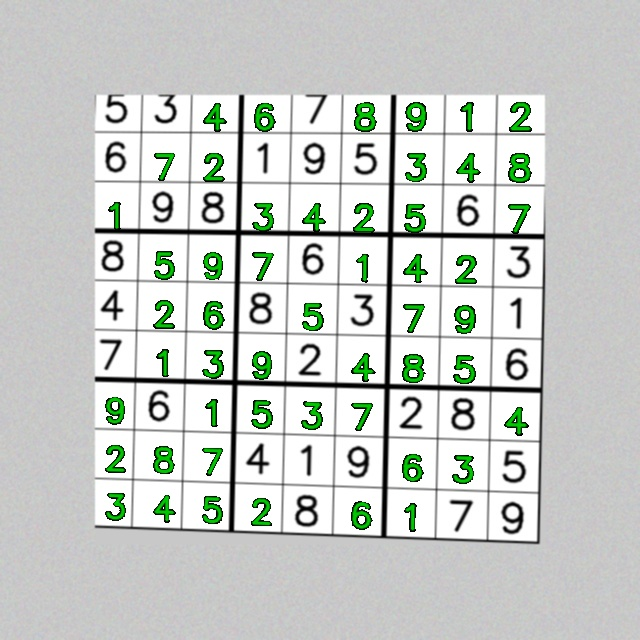

# Sudoku Vision Solver

Detects a Sudoku puzzle in a photo, reads the printed digits, solves it,
and hands back an image with the solution drawn directly onto your
original photo — all from the command line.

```
python main.py solve --image sample_images/sample_sudoku.jpg --output output/solved.jpg
```

| Input (photo of a puzzle) | Output (solution overlaid) |
|---|---|
|  |  |

*(Black digits = the puzzle's original clues. Green digits = filled in by the solver.)*

---

## Overview

This project is a Computer Vision course submission built around three
functional modules, each implemented as an independent, testable
Python package under `src/`:

1. **Grid detection** (`src/grid_detector.py`) — locates the Sudoku
   grid's outer boundary in a photo (via adaptive thresholding +
   contour detection) and applies a perspective transform to flatten
   it into a top-down square image.
2. **Digit recognition** (`src/digit_recognizer.py`, `src/digit_features.py`,
   `scripts/train_digit_model.py`) — splits the flattened grid into 81
   cells, determines which are empty, and classifies the digit in
   every filled cell using an SVM trained on HOG (+ ink-density)
   features, on a synthetic dataset generated entirely in-code.
3. **Solving & overlay** (`src/sudoku_solver.py`, `src/overlay_renderer.py`)
   — solves the recognized puzzle with a backtracking search (MRV
   heuristic), then warps the newly-solved digits back onto the
   *original* photo in its original perspective.

See [`statement.md`](statement.md) for the full problem statement,
scope, and target users.

## Features

- Fully offline, self-contained digit classifier — no external dataset
  download required; `scripts/train_digit_model.py` generates its own
  synthetic training data and reports held-out accuracy
- Robust-ish grid detection: adaptive thresholding + an iterative
  polygon-approximation search handle moderately tilted/noisy photos
- Clear, domain-specific error messages (`src/exceptions.py`) instead
  of raw stack traces for common failure modes (no grid found, model
  missing, unsolvable puzzle, etc.)
- Structured logging to both console and a `.log` file
- `--debug` mode that also saves the intermediate warped grid and a
  clean flat rendering of the solved grid, useful for a report/demo
- Unit tests (`tests/`) covering the solver logic, grid detection, and
  digit recognition in isolation

## Technologies / Tools Used

- **Python 3.10+**
- **OpenCV** (`opencv-python-headless`) — image preprocessing, contour
  detection, perspective transforms, HOG feature extraction
- **NumPy** — array/image manipulation
- **scikit-learn** — SVM classifier, train/test split, evaluation metrics
- **joblib** — model serialization
- **pytest** — unit testing
- Standard library `argparse` (CLI) and `logging` (structured logs)

---

## Setup & Installation

### 1. Prerequisites

- Python **3.10 or newer** installed (`python3 --version` to check)
- `pip` available
- No GPU, external dataset, or internet access is required to run or
  retrain this project — everything (including training data) is
  generated locally.

### 2. Clone the repository

```bash
git clone https://github.com/<your-username>/<your-repo-name>.git
cd <your-repo-name>
```

### 3. Create and activate a virtual environment (recommended)

```bash
python3 -m venv .venv

# macOS / Linux
source .venv/bin/activate

# Windows (PowerShell)
.venv\Scripts\Activate.ps1
```

### 4. Install dependencies

```bash
pip install -r requirements.txt
```

### 5. The trained model

A pretrained digit classifier is committed at
`models/digit_classifier.pkl`, so you can run `solve` immediately
without training anything first. If you'd like to regenerate it
yourself from scratch (e.g. to verify reproducibility, or after
modifying `scripts/train_digit_model.py`):

```bash
python main.py train
```

This generates a fresh synthetic dataset of ~1,600 rendered digit
images (9 digits x 6 fonts x 30 augmented variants each), trains an
SVM on HOG features, prints a held-out accuracy/classification report,
and overwrites `models/digit_classifier.pkl`.

---

## Running the Project

### Solve the bundled sample puzzle

A synthetic demo photo is included at `sample_images/sample_sudoku.jpg`
(generated by `scripts/generate_sample_puzzle.py`) so you can try the
full pipeline immediately:

```bash
python main.py solve --image sample_images/sample_sudoku.jpg --output output/solved.jpg
```

Expected console output ends with something like:

```
... Recognized puzzle:
... 5 3 . . 7 . . . .
... 6 . . 1 9 5 . . .
... (etc.)
... Solving puzzle...
... Rendering solution back onto the original image...
... Done in ~1 second. Result saved to: output/solved.jpg
```

Open `output/solved.jpg` to see the original clues in black and the
solver's answers overlaid in green.

### Solve your own puzzle photo

```bash
python main.py solve --image /path/to/your/photo.jpg --output output/my_solution.jpg
```

Tips for a good input photo:
- Take the photo as close to straight-down as reasonably possible
- Make sure the whole grid (all 4 corners) is visible and well-lit
- Printed/typed puzzles work best; this classifier was not trained on
  handwriting

### Useful flags

| Flag | Description |
|---|---|
| `--image` | **(required)** Path to the input puzzle photo |
| `--output` | Where to save the solved image (default: `output/solved.jpg`) |
| `--model`  | Path to a custom trained classifier `.pkl` (default: `models/digit_classifier.pkl`) |
| `--debug`  | Also saves `debug_warped_grid.jpg` and `debug_solved_flat.jpg` next to the output |
| `--verbose`| Prints full Python tracebacks instead of a clean one-line error message |

Run `python main.py --help` or `python main.py solve --help` for the
full list at any time.

### Regenerate the sample puzzle image

```bash
python scripts/generate_sample_puzzle.py
```

---

## Testing

The project uses `pytest`. From the repository root:

```bash
pytest
```

or with more detail:

```bash
pytest -v
```

This runs unit tests covering:
- `tests/test_solver.py` — backtracking solver correctness, invalid/
  unsolvable puzzle handling, constraint-checking helpers
- `tests/test_grid_detector.py` — corner-ordering geometry, grid
  detection on a clean synthetic image, correct failure on an image
  with no grid, cell-splitting output shape
- `tests/test_digit_recognizer.py` — empty-cell detection, digit crop
  isolation, error handling for a missing model file, output shape of
  a full grid recognition pass

All 24 tests should pass with no external dependencies beyond what's
in `requirements.txt`.

---

## Project Structure

```
sudoku-vision-solver/
├── main.py                      # CLI entry point (solve / train subcommands)
├── requirements.txt
├── README.md
├── statement.md                 # Problem statement, scope, target users
├── src/
│   ├── grid_detector.py         # Module 1: grid detection + perspective warp
│   ├── digit_recognizer.py      # Module 2: digit isolation + classification
│   ├── digit_features.py        # Shared HOG + ink-density feature extraction
│   ├── sudoku_solver.py         # Module 3: backtracking solver
│   ├── overlay_renderer.py      # Draws the solution back onto the photo
│   ├── utils.py                 # Logging, image I/O, geometry helpers
│   └── exceptions.py            # Custom exception hierarchy
├── scripts/
│   ├── train_digit_model.py     # Synthetic dataset generation + SVM training
│   └── generate_sample_puzzle.py# Builds the bundled demo photo
├── tests/                       # pytest unit tests
├── models/
│   └── digit_classifier.pkl     # Pretrained classifier (committed)
├── sample_images/
│   └── sample_sudoku.jpg        # Bundled demo input
└── output/                      # Solved images are written here
```

## Known Limitations / Future Enhancements

- Running `pytest` or `solve` may print a scikit-learn
  `InconsistentVersionWarning` if your installed scikit-learn's minor
  version differs from the one `models/digit_classifier.pkl` was
  trained with. This is expected and harmless; run `python main.py
  train` to regenerate the model with your exact installed version if
  you'd like the warning gone entirely.
- Digit recognition is trained on synthetically rendered printed fonts,
  not handwriting — accuracy will drop on handwritten puzzles
- Very oblique photo angles, heavy glare, or low contrast can cause
  grid detection to fail; the CLI reports this clearly rather than
  guessing
- A production version could add video/webcam input, a larger and more
  diverse digit dataset, and automatic photo-quality feedback to the user
